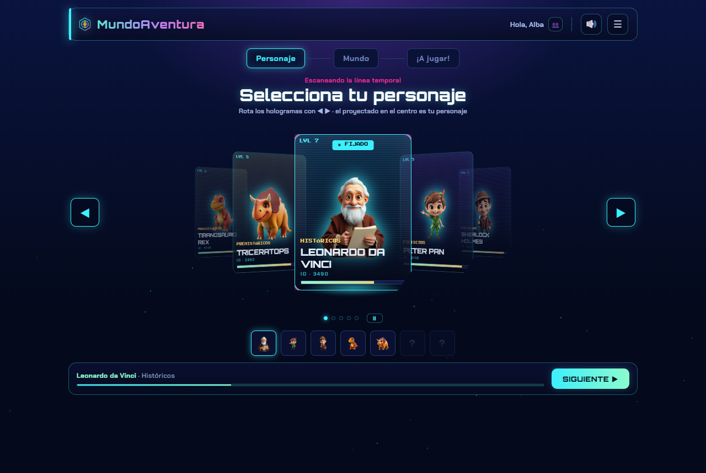
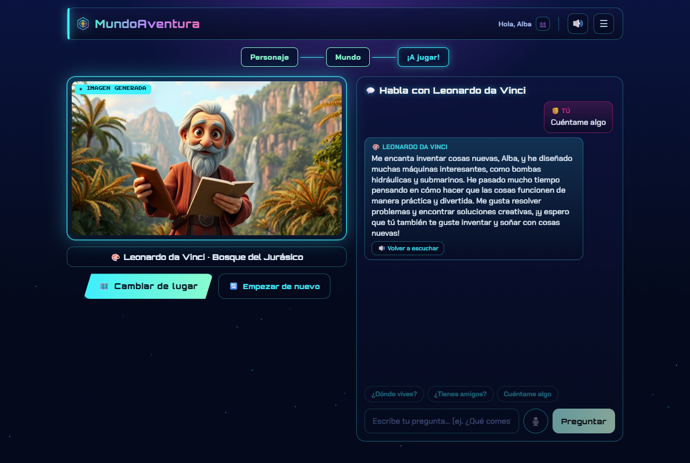
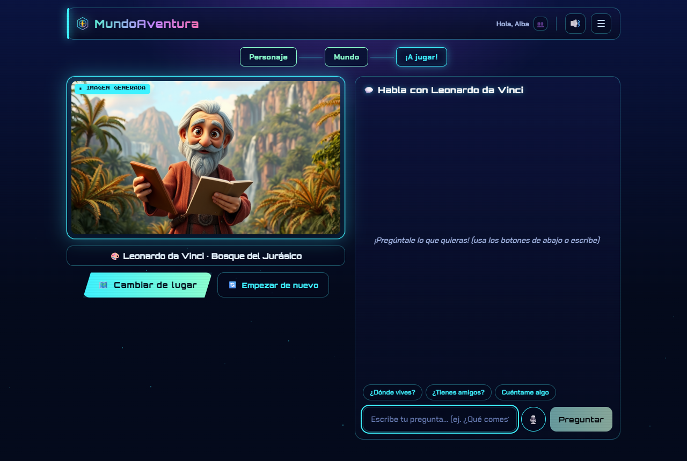
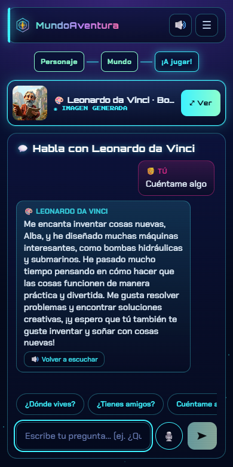
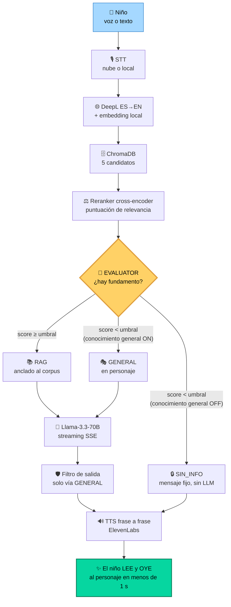
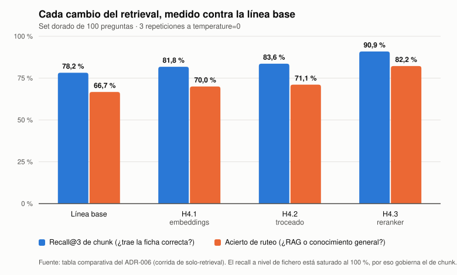
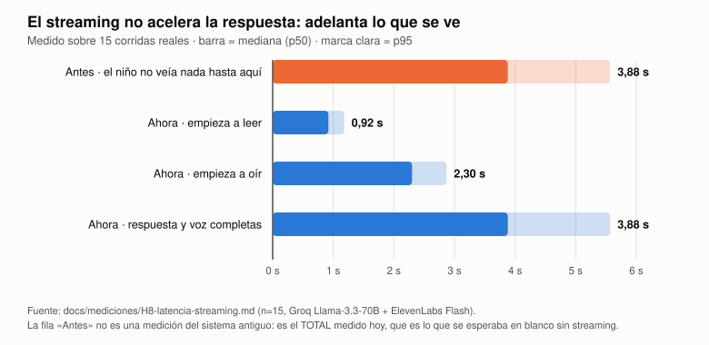

<div align="center">

# 🦖 MundoAventura 🌀

### El asistente conversacional donde los niños **hablan de verdad** con sus personajes favoritos

*Proyecto Capstone · IA Generativa · Agentes · RAG · Voz*

<br>

[](https://chatmundoaventura.com)
[](COMPLETAR_ENLACE_YOUTUBE)

**✅ Aplicación desplegada en producción sobre un servidor VPS propio — no es un prototipo local**

<br>

[](https://github.com/dlopezbernal/mundoaventura/actions/workflows/ci.yml)


</div>

---

<div align="center">

## 🚀 Tres formas de evaluar este proyecto

</div>

<table>
<tr>
<td width="33%" align="center">

### 🌍 ONLINE

**La app está viva y desplegada**

### [chatmundoaventura.com](https://chatmundoaventura.com)

**VPS propio** · Ubuntu 24.04 LTS
2 vCPU · 4 GB RAM · sin GPU
Caddy + HTTPS · dominio propio
CI/CD: *merge a `main` despliega*

*No hace falta instalar nada*

</td>
<td width="33%" align="center">

### 🎥 VÍDEO DEMO

**Disponible en dos sitios**

📁 **En este repositorio**
`docs/demo/video-demo.mp4`
*(descargable, sin internet)*

▶️ **En YouTube**
[Ver ahora](COMPLETAR_ENLACE_YOUTUBE)

*≈7 min · guion en [`DEFENSA.md`](docs/DEFENSA.md)*

</td>
<td width="33%" align="center">

### 📖 ESTA MEMORIA

**Autosuficiente y offline**

Arquitectura, decisiones,
métricas y capturas
**sin ejecutar nada**

📸 [`docs/img/`](docs/img/) · 📐 [18 ADRs](docs/DECISIONES.md)
📊 [`EVALUACION.md`](docs/EVALUACION.md)

*Todo lo evaluable, aquí*

</td>
</tr>
</table>

---

<div align="center">

## 🎯 ¿Qué hace MundoAventura?

</div>

> Un niño (8–12 años) elige un **personaje** y un **mundo**, y la app le **genera la escena**. Después **habla con ese personaje por voz o por texto**. El personaje le responde **con su propia voz**, le llama **por su nombre**, y lo que cuenta sobre su mundo **no se lo inventa**: está fundamentado en un corpus documental mediante RAG.

<table>
<tr>
<td width="50%">

**🗣️ Conversación natural**
Habla por micrófono o escribe. El texto empieza a aparecer en **0,92 s** (p50) y la voz suena a los 2,3 s, frase a frase.

**🎭 Personajes con alma**
Cada uno tiene su prompt, su voz, su avatar y su corpus. Se crean desde la interfaz, **sin tocar código**.

</td>
<td width="50%">

**📚 No inventa: fundamenta**
Un agente evaluador decide si hay evidencia suficiente en el corpus **antes** de responder.

**🛡️ Seguro para menores**
Anti-inyección, filtro de salida, consentimiento parental, STT local opcional y RGPD real.

</td>
</tr>
</table>

<table>
<tr>
<td width="50%"></td>
<td width="50%"></td>
</tr>
<tr>
<td align="center"><i>1 · Elegir personaje (carrusel con avatares generados)</i></td>
<td align="center"><i>3 · La escena generada + el chat con voz</i></td>
</tr>
<tr>
<td></td>
<td></td>
</tr>
<tr>
<td align="center"><i>2 · «Abriendo el portal…» mientras se genera la imagen</i></td>
<td align="center"><i>Responsive real: la misma pantalla en móvil</i></td>
</tr>
</table>

<div align="center">

*Más capturas (acceso, «¿quién juega?», consentimiento de la foto, configuración, manual) en [`docs/img/`](docs/img/).*

</div>

---

<div align="center">

## ✅ Requisitos del Capstone → dónde se demuestran

</div>

| | Requisito | Cómo se cumple | Sección |
|:--:|---|---|:--:|
| 🤖 | **IA Generativa** | LLM Llama-3.3-70B en personaje · TTS ElevenLabs · generación de escena con FLUX schnell | [§2](#2-arquitectura-el-viaje-de-una-pregunta) |
| 🧠 | **Agentes** | **Evaluator**: rutea cada pregunta según la evidencia recuperada, con umbrales calibrados | [§3](#3-el-evaluator-el-cerebro-que-decide) |
| 🛠️ | **Stack del curso** | FastAPI · React · ChromaDB · embeddings + reranker · APIs LLM · banco de evaluación propio | [§1](#1-stack-tecnológico) |
| 💻 | **Código en GitHub** | Este repositorio · 18 ADRs · suite de tests · CI/CD real | [§6](#6-estructura-del-repositorio) |
| 📝 | **Memoria** | Este README + [`docs/`](docs/README.md) (arquitectura, evaluación, privacidad, despliegue) | *aquí* |
| 🎬 | **Vídeo demo** | En el repo **y** en YouTube | [§7](#7-el-vídeo-demo) |

---

<div align="center">

## 1. Stack tecnológico

</div>

<table>
<tr><th colspan="2">☁️ EN LA NUBE — modelos generativos grandes</th></tr>
<tr><td><b>LLM</b></td><td><b>Groq · Llama-3.3-70B</b> — respuesta en personaje, en streaming (ganador del estudio de H6)</td></tr>
<tr><td><b>Voz (TTS)</b></td><td><b>ElevenLabs Flash</b> — una voz distinta por personaje, sintetizada <b>frase a frase</b>, con caché en disco</td></tr>
<tr><td><b>Imagen</b></td><td><b>FLUX schnell</b> vía <b>Replicate</b> — escena del mundo y avatares del catálogo (con recorte de fondo por <code>rembg</code>)</td></tr>
<tr><td><b>Traducción</b></td><td><b>DeepL</b> ES→EN — traduce la pregunta antes de buscar y detecta el idioma de cada documento</td></tr>
</table>

<table>
<tr><th colspan="2">💻 EN LOCAL SOBRE CPU — modelos pequeños de percepción y recuperación</th></tr>
<tr><td><b>Embeddings</b></td><td><b>fastembed</b> (ONNX, sin torch) — <code>multi-minilm</code> multilingüe, sin GPU</td></tr>
<tr><td><b>Reranking</b></td><td><b>Cross-encoder <code>jina-v2</code></b> (ONNX) — puntúa la relevancia real de cada candidato <b>y decide el ruteo</b></td></tr>
<tr><td><b>Voz (STT)</b></td><td><b>faster-whisper</b> (<code>large-v3-turbo</code>, CTranslate2, sin torch) — opcional: <b>el audio del niño no sale de la máquina</b></td></tr>
</table>

<table>
<tr><th colspan="2">🏗️ INFRAESTRUCTURA</th></tr>
<tr><td><b>Backend</b></td><td>FastAPI en capas (routers → services → config) · REST + <b>SSE</b> · <code>uv</code> + <code>uv.lock</code></td></tr>
<tr><td><b>Frontend</b></td><td>React SPA (Vite + TypeScript; solo <code>react</code> + <code>react-dom</code>) · <b>PWA instalable</b> + APK Android (TWA)</td></tr>
<tr><td><b>Vectorial</b></td><td>ChromaDB — distancia coseno, una colección versionada por backend de embeddings</td></tr>
<tr><td><b>Persistencia</b></td><td>SQLite — catálogos, cuentas de familia, auditoría y <b>configuración editable en caliente desde la UI</b></td></tr>
<tr><td><b>🌍 Despliegue</b></td><td><b>VPS propio</b> (Ubuntu 24.04 LTS · 2 vCPU · 4 GB) · <b>Caddy</b> (TLS de Let's Encrypt) + <b>systemd</b> → <a href="https://chatmundoaventura.com">chatmundoaventura.com</a></td></tr>
</table>

> [!NOTE]
> **Principio arquitectónico del proyecto**: lo pequeño, en local sobre CPU (sin GPU, coste 0 por uso); lo generativo grande, en la nube. Resultado: el backend no instala torch ni CUDA, cabe en 4 GB de RAM y la aplicación corre en producción con **coste casi nulo** en *free tiers*. Justificado en el [ADR-011](docs/decisiones/ADR-011-arquitectura-hibrida.md).

---

<div align="center">

## 2. Arquitectura: el viaje de una pregunta

</div>



<details>
<summary>📄 <b>Ver el mismo diagrama en texto plano</b> (para lectura offline sin renderizado)</summary>

```
🧒 Niño (voz o texto)
      │ STT si es voz (ElevenLabs Scribe · faster-whisper local · Whisper en Groq)
      ▼
🌐 DeepL ES→EN ──► Embedding de la consulta (fastembed, CPU local)
      ▼
🗄️ ChromaDB: 5 candidatos del corpus de ESE personaje (distancia coseno)
      ▼
⚖️ Reranker cross-encoder jina-v2 (local) ──► puntuación de relevancia real
      ▼
╔══════════════ 🧠 EVALUATOR — el "agente" del sistema ══════════════╗
║  score ≥ RERANK_UMBRAL   → 📚 RAG: respuesta FUNDAMENTADA (top-3) ║
║  score <  RERANK_UMBRAL  → según PERMITIR_CONOCIMIENTO_GENERAL:   ║
║        · true  → 🎭 GENERAL: conocimiento propio, EN PERSONAJE    ║
║        · false → 🔒 SIN_INFO: mensaje fijo, SIN llamar al LLM     ║
╚═══════════════════════════════════════════════════════════════════╝
      ▼
🤖 LLM Groq · Llama-3.3-70B (prompt del personaje) ──► streaming SSE
      │   · las fichas del RAG entran DELIMITADAS: son datos, nunca órdenes
      ▼
🛡️ Filtro de salida (solo la vía GENERAL) ──► 🔊 TTS ElevenLabs FRASE A FRASE
      ▼
✨ El niño ve el texto aparecer y OYE al personaje casi al instante
```

</details>

> [!TIP]
> **Entra en inglés, sale en español.** El corpus, las consultas de recuperación y todos los prompts al LLM están en **inglés** (Llama sigue mejor las instrucciones y los embeddings puntúan mejor); solo se traduce la *pregunta* del niño, y la *respuesta* se genera directamente en español por instrucción del prompt. Se probó quitar DeepL y consultar en español directo: **empeoraba** el recall y el ruteo, así que se descartó con datos ([ADR-014](docs/decisiones/ADR-014-retirada-deepl.md)).

Diseño completo (capas, invariantes, flujos) en [`ARQUITECTURA.md`](docs/ARQUITECTURA.md); la teoría de fondo (qué es RAG, chunking con solape, CLIP/T5) en el [anexo didáctico](docs/ANEXO-DIDACTICO.md).

---

<div align="center">

## 3. El Evaluator: el cerebro que decide

### *La pieza que convierte esto en un agente, y no en «un prompt bonito»*

</div>

El problema de fondo de todo RAG: **¿qué hace el sistema cuando el corpus no tiene la respuesta?** La opción cómoda es dejar que el LLM improvise. Con niños, eso es inaceptable.

El **Evaluator** (`rag_service._decidir_origen`) mide la evidencia real de los fragmentos recuperados y **rutea** hacia uno de tres caminos:

<table>
<tr>
<th width="33%">📚 RAG — HAY FUNDAMENTO</th>
<th width="33%">🎭 GENERAL — NO ESTÁ EN EL CORPUS</th>
<th width="33%">🔒 SIN_INFO — NO PROCEDE</th>
</tr>
<tr>
<td valign="top">

`rerank_score ≥ umbral`

Responde **anclado al corpus**, con los 3 mejores fragmentos como fichas.

*«Yo comía carne, sobre todo otros dinosaurios…»*

Con `MOSTRAR_FUENTES` el niño ve **📚 ¿De dónde lo he sacado?** con la procedencia real.

</td>
<td valign="top">

`rerank_score < umbral` y conocimiento general **activado**

Responde con **conocimiento propio del modelo, en personaje**, sin fingir que viene del corpus.

Pasa por el **filtro de salida** (idioma, longitud, términos): si no lo pasa, se degrada al mensaje fijo.

</td>
<td valign="top">

`rerank_score < umbral` y conocimiento general **desactivado**

**Mensaje seguro fijo y editable.** No se llama al LLM en absoluto: cero coste y cero riesgo.

Es la configuración de la línea base medida.

</td>
</tr>
</table>

**Tres modos de decisión, y cuál se entrega.** Sin reranker, el Evaluator usa umbrales de distancia coseno (`umbral`), un LLM-juez (`llm`) o ambos (`hibrido`, los umbrales resuelven gratis lo claro y el juez desempata la banda ambigua). **Con el reranker activo —la configuración entregada— el ruteo lo decide la puntuación del cross-encoder y el LLM-juez ya no se llama**: mejor decisión y una llamada de red menos ([ADR-006](docs/decisiones/ADR-006-reranker.md)).

> [!IMPORTANT]
> Los umbrales **no se eligieron a ojo**: se calibraron contra el banco de evaluación (§4) y son **editables desde la pantalla de Admin, en caliente, sin desplegar código**. El umbral del RAG se expone tal cual lo usa el motor (distancia coseno 0–2, o el logit del reranker) — nunca como un «% de similitud» maquillado.

---

<div align="center">

## 4. Evaluación: medir antes y después

</div>

> No se cambió una sola pieza del pipeline sin compararla contra una **línea base inmutable**. `evals/resultados/BASELINE.csv` no se regenera nunca: es el punto de referencia congelado.

<table>
<tr>
<td width="50%" valign="top">

**📋 Banco de evaluación propio** — [`evals/`](evals/)

- **Set dorado**: 100 preguntas (20 por personaje), en **español infantil real** *con faltas*, repartidas en 6 literal / 5 inferencial / 4 fuera de dominio / 3 sin respuesta / 2 ambigua.
- **Set de seguridad**: 18 preguntas adversariales (muerte, violencia, miedo, salir del papel, datos personales, inyección).
- **Retrieval congelado**: un *fixture* de fragmentos recuperados que permite comparar **generadores** sin ruido del retriever.

**📊 Métricas deterministas, sin juez LLM**
Acierto de ruteo · recall@3 de chunk · distancia · idioma (`lingua`) · legibilidad **INFLESZ** · «roto de personaje» · latencia y coste por etapa. Cada pregunta se corre **3× a `temperature=0`**.

</td>
<td width="50%" valign="top">

**🏁 Resultados: línea base → configuración entregada**

| Métrica | Baseline | Entregado |
|---|:--:|:--:|
| Acierto de ruteo | 66,7 % | **82,2 %** |
| Recall@3 (chunk) | 78,2 % | **90,9 %** |
| Latencia de retrieval | 191 ms | 27 ms *(+665 del reranker)* |
| Responde en español | 99 % | **100 %** |
| Roto de personaje | 0 % | **0 %** |
| Set adversarial | — | **0 fallos / 18** |
| Tiempo hasta el 1.er token | ~4 s | **0,92 s** |

*300 filas, 0 errores. Corridas archivadas en `evals/resultados/`.*

</td>
</tr>
</table>

<div align="center">


</div>

**El arco, hito a hito** (detalle y tablas crudas en [`EVALUACION.md`](docs/EVALUACION.md)):

| Hito | Palanca | Antes → Después |
|---|---|---|
| **H4.1** | Embeddings multilingües locales (`fastembed`) | recall 78,2 → 81,8 % · retrieval **191 → 27 ms (7×)** |
| **H4.2** | Troceado por estructura de Markdown | recall 81,8 → 83,6 % *(prefijar la ruta lo empeoraba: medido y descartado)* |
| **H4.3** | **Reranker cross-encoder** | recall 83,6 → **90,9 %** · ruteo 71,1 → **82,2 %**, ya equilibrado en los 4 tipos |
| H4.4 | Quitar DeepL (hipótesis) | ❌ **descartada con datos**: −5,4 recall, −11,1 ruteo |
| **H6** | Elección del LLM: puertas → pesos → test ciego | **groq-llama70b** gana por preferencia humana (5 evaluadores), divergiendo del ganador automático |
| **H8** | Streaming SSE + TTS por frases | tiempo hasta el primer contenido **~4 s → 0,92 s** (p95 1,18 s, n=15) |

> [!NOTE]
> **Limitaciones declaradas, no escondidas.** El juez LLM de H6 **no** alcanzó el 85 % de acuerdo con el humano (75 % el mejor) y se usó solo como señal indicativa; el test ciego fue de **n=5** evaluadores; el recall a nivel de *fichero* está saturado al 100 % (por eso se gobierna por el de *chunk*); la legibilidad **no se volvió a medir** tras el ajuste de prompts; y el «tacto» del set adversarial se juzga a mano. La lista completa está en [`EVALUACION.md §12`](docs/EVALUACION.md).

---

<div align="center">

## 5. Tres problemas reales y cómo se resolvieron

</div>

<table>
<tr>
<td width="50%" valign="top">

### ⏱️ «Un niño no espera»

**Problema**
Generar la respuesta entera y luego sintetizar la voz producía silencios de ~4 s. Un niño de 8 años ya se ha ido.

**Solución**
El LLM emite por **SSE** token a token y el TTS sintetiza **frase a frase**: la primera frase ya suena mientras el modelo escribe la segunda.

**Resultado medido** (n=15, [H8](docs/mediciones/H8-latencia-streaming.md))
### ⚡ p50 0,92 s · p95 1,18 s
*Primera voz a los 2,30 s. Antes: ~4 s sin ver nada.*

</td>
<td width="50%" valign="top">

### 🔐 «Es la voz de un menor»

**Problema**
Enviar el audio de un niño a una API de terceros es un riesgo que no compensa asumir.

**Solución**
**STT ejecutable en local** (faster-whisper, CTranslate2 **sin torch**), seleccionable en caliente. El audio no sale de la máquina. Si el modelo local no carga, **cae solo a la nube** y la app nunca se queda muda.

**Resultado**
### 🔒 Privacidad por diseño
*Minimización del RGPD desde el diseño, no como parche ([ADR-008](docs/decisiones/ADR-008-stt-local.md)).*

</td>
</tr>
</table>

### 🧵 «Un chat largo congelaba la app entera»

Los endpoints que llaman a SDKs **síncronos** de red se declararon `def` (no `async def`), para que FastAPI los ejecute en su *threadpool* y el *event loop* no se bloquee. Medido con dos chats largos en vuelo: **`/health` pasó de 5.959 ms a 2,2 ms** ([H2](docs/mediciones/H2-concurrencia.md), criterio de aceptación declarado antes de medir: < 200 ms).

### 🛡️ Seguridad infantil y RGPD — resumen

| Capa | Medida |
|---|---|
| **Entrada** | Las fichas del RAG entran **delimitadas** (`<documento>…</documento>`) y el prompt las trata como **datos, nunca órdenes**: un documento que diga «ignora tus instrucciones» no reescribe al personaje |
| **Salida** | Filtro de contenido (idioma, longitud, términos) sobre la vía **GENERAL**, la no fundamentada; si no pasa, se entrega el mensaje seguro |
| **Voz** | STT local opcional — el audio del menor no viaja a terceros |
| **Foto** | **Consentimiento parental** (PIN de familia) antes de abrir el selector; la foto **no se persiste**, se procesa solo en memoria |
| **Cuentas** | Cuenta de familia (email + contraseña), multi-perfil de niños, PIN de familia y Admin con **contraseña ≥ 8 + 2FA TOTP opcional** |
| **Datos** | Minimización (solo nombre y sexo del niño), **retención configurable** de la auditoría (90 días por defecto) y **derecho de supresión**: borrar la cuenta elimina familia, perfiles, sesiones y registro de uso |
| **Abuso** | Candado de acceso, sesión obligatoria en los endpoints que cuestan dinero, rate limit por IP, **cupo diario de imágenes** y login endurecido contra fuerza bruta |

Flujos de datos personales y checklist RGPD/LOPDGDD completos en [`PRIVACIDAD.md`](docs/PRIVACIDAD.md); las tres barreras, en el [ADR-010](docs/decisiones/ADR-010-seguridad-infantil.md).

### 📐 Diario técnico: los ADRs

Cada decisión relevante está en [`docs/decisiones/`](docs/decisiones/) con el formato **contexto → opciones → decisión → consecuencias**. Se leen como la bitácora del proyecto: qué se probó, qué se descartó y por qué.

<details>
<summary><b>Ver los 18 ADRs</b></summary>

| # | Decisión | Estado |
|---|---|---|
| [001](docs/decisiones/ADR-001-candado-tunel.md) | Candado del túnel: código de acceso + rate limit + cupo | ✅ |
| [002](docs/decisiones/ADR-002-concurrencia.md) | Endpoints síncronos (`def`) para no bloquear el *event loop* | ✅ |
| [003](docs/decisiones/ADR-003-metodologia-evaluacion.md) | Metodología de evaluación: métricas deterministas + retrieval congelado | ✅ |
| [004](docs/decisiones/ADR-004-embeddings-multilingues.md) | Embeddings multilingües locales (fastembed) + recalibración de umbrales | ✅ |
| [005](docs/decisiones/ADR-005-troceado-estructural.md) | Troceado por estructura de Markdown (sección sí, prefijo no) | ✅ |
| [006](docs/decisiones/ADR-006-reranker.md) | Reranker cross-encoder + ruteo por puntuación (jubila el LLM-juez) | ✅ |
| [007](docs/decisiones/ADR-007-eleccion-llm.md) | Elección del LLM generador → **groq-llama70b** | ✅ |
| [008](docs/decisiones/ADR-008-stt-local.md) | Transcripción local con faster-whisper + proveedor seleccionable | ✅ |
| [009](docs/decisiones/ADR-009-streaming.md) | Streaming SSE + TTS por frases + caché de audio | ✅ |
| [010](docs/decisiones/ADR-010-seguridad-infantil.md) | Seguridad infantil: anti-inyección, filtro de salida y consentimiento | ✅ |
| [011](docs/decisiones/ADR-011-arquitectura-hibrida.md) | Arquitectura híbrida: percepción local, generación en la nube | ✅ |
| [012](docs/decisiones/ADR-012-capa-proveedor-openai.md) | Capa de proveedor de LLM compatible con OpenAI | ✅ |
| [013](docs/decisiones/ADR-013-tts-elevenlabs.md) | Mantener ElevenLabs (nube) para el TTS | ✅ |
| [014](docs/decisiones/ADR-014-retirada-deepl.md) | Retirar DeepL del camino crítico | ❌ **descartada con datos** |
| [015](docs/decisiones/ADR-015-despliegue-nativo-vps.md) | Despliegue nativo en VPS (uv + systemd + Caddy), no Docker ni PaaS | ✅ |
| [016](docs/decisiones/ADR-016-sesion-familia-endpoints-caros.md) | Sesión de familia obligatoria en los endpoints que cuestan dinero | ✅ |
| [017](docs/decisiones/ADR-017-pwa-twa.md) | App de Android como PWA + TWA, no Capacitor ni React Native | ✅ |
| [018](docs/decisiones/ADR-018-runner-autoalojado.md) | Runner autoalojado en el VPS en vez de SSH desde GitHub | ✅ |

</details>

---

<div align="center">

## 6. Estructura del repositorio

</div>

```
📦 mundoaventura
├── ⚙️  backend/           API FastAPI (Python 3.12, sin torch ni CUDA)
│   ├── routers/          Endpoints finos: validan → llaman a un service → mapean errores
│   ├── services/         Toda la lógica: RAG · Evaluator · LLM · TTS/STT · seguridad · settings
│   └── documentos/       La base de conocimiento del RAG, una carpeta por personaje
├── 🎨 frontend-react/    SPA React (Vite + TS) · PWA instalable · un único cliente HTTP
├── 🧪 tests/             Suite de pytest del backend (la que corre el CI)
├── 📊 evals/             Banco de evaluación: sets YAML, runner, métricas y línea base congelada
├── 📚 docs/
│   ├── decisiones/       Los 18 ADRs — el diario técnico
│   ├── mediciones/       Concurrencia, GPU/STT, latencia, despliegue sin corte
│   ├── img/              📸 Capturas de todas las pantallas + gráficas
│   └── demo/             🎥 video-demo.mp4
├── 🚀 deploy/            Lo que corre en el VPS: systemd, Caddyfile, despliegue y copias
├── 🔧 scripts/           Arranque doble, generación de tipos desde OpenAPI, bancos de medida
└── 📖 README.md          Esta memoria
```

> [!TIP]
> **Para evaluación sin conexión**: [`docs/img/`](docs/img/) contiene **capturas de todas las pantallas** y `docs/demo/` el **vídeo como archivo**. Nada de lo evaluable depende de que la web esté disponible.

**Contrato de tipos autogenerado.** Todos los endpoints declaran un `response_model` de Pydantic, y los tipos del frontend se **generan** del esquema OpenAPI (`uv run python -m scripts.gen_types`): el backend es la única fuente de verdad y no hay tipos escritos a mano que se desincronicen.

---

<div align="center">

## 7. El vídeo demo

[](COMPLETAR_ENLACE_YOUTUBE)
[](docs/demo/video-demo.mp4)

</div>

Grabado **contra producción** (`chatmundoaventura.com`), no contra `localhost`. Guion completo, con clics exactos y plan B por paso, en [`DEFENSA.md`](docs/DEFENSA.md).

| ⏱️ | Escena | Qué se demuestra |
|:--:|---|---|
| 0:00 | **Acceso e instalación** | Cuenta de familia (no es anónima) · **PWA instalable** desde la propia pantalla de acceso |
| 0:50 | **¿Quién juega? → personaje → mundo** | Multi-perfil · catálogos desde la BBDD, no del código · sonido arcade sintetizado |
| 2:00 | **La escena se genera** | Generación de imagen en la nube (FLUX) con animación de espera |
| 2:40 | **RAG en acción** | Pregunta fundamentada → respuesta **en streaming** + voz, y el desplegable **«📚 ¿De dónde lo he sacado?»** |
| 3:30 | **No inventa** | Pregunta fuera de dominio → el Evaluator rutea a GENERAL/SIN_INFO en vez de alucinar anclado |
| 4:00 | **Voz y consentimiento** | Micrófono (STT) · subir la foto pasa por el **consentimiento parental** con PIN |
| 5:20 | **Móvil** | La misma URL, responsive real |
| 6:00 | **Tras las bambalinas** | 🛡️ Admin: documentos del RAG, umbrales en caliente, auditoría · repo, ADRs y banco de evaluación |

---

<div align="center">

## 8. Ejecutar en local

</div>

**Requisitos:** Python **3.12** + [`uv`](https://docs.astral.sh/uv/) · **Node 24+** · claves de **Replicate** (obligatoria), **DeepL** (obligatoria para el chat) y **ElevenLabs** (opcional, para la voz).

```powershell
# 1 · Dependencias
uv sync                                 # crea .venv e instala EXACTAMENTE lo del uv.lock
cd frontend-react; npm install; cd ..   # una sola vez

# 2 · Configuración
Copy-Item .env.example .env             # rellena REPLICATE_API_TOKEN, DEEPL_API_KEY, ELEVENLABS_API_KEY

# 3 · Construir el índice del RAG — OBLIGATORIO antes de chatear
uv run python -m backend.ingest

# 4 · Arrancar backend + frontend, cada uno en su ventana
.\scripts\dev.ps1                       # o -Solo back / -Solo front
```

A mano, en dos terminales: `uv run uvicorn backend.main:app --reload` (backend en `:8000`, docs en `/docs`) y `cd frontend-react; npm run dev` (frontend en `:5173`, con proxy de `/api` y `/health` → **sin CORS que configurar**).

Comprueba `GET /health`: debe mostrar `token_configurado: true`, `deepl_ok: true` y `elevenlabs_ok: true`.

> [!IMPORTANT]
> **Un clon nuevo arranca en la línea base, no en la configuración entregada** — y es a propósito. Los valores por defecto de `config.py` son los de la baseline (`replicate` + `minilm-en` + troceado recursivo + `RERANKER=off`) para que las comparaciones de [`EVALUACION.md`](docs/EVALUACION.md) se puedan repetir sin tocar nada. La configuración afinada (Groq + `multi-minilm` + estructura + `jina-v2`) vive en el `.env` y en el SQLite, y **llevarla al servidor es un paso explícito del despliegue** ([`DESPLIEGUE.md §3.7`](docs/DESPLIEGUE.md)).

**Sin claves**, el sistema degrada de forma controlada en vez de romper: sin ElevenLabs la voz se desactiva y **el chat de texto sigue funcionando**; sin DeepL el chat responde con un error claro (y no se pueden gestionar documentos); sin Replicate no hay generación de imagen. La app **nunca** se queda muda ni filtra el error crudo del SDK al niño.

<details>
<summary><b>📚 Preparar la base de conocimiento</b></summary>

El conocimiento del chat **no está en el código**: viene de documentos que tú aportas, una **carpeta por personaje** en `backend/documentos/<personaje_id>/` (`.pdf`, `.txt`, `.md`). El repositorio ya trae **11 documentos** en cinco carpetas (T-Rex, Triceratops, Peter Pan, Sherlock Holmes y Leonardo da Vinci), así que se puede chatear sin aportar nada.

- **Sin terminal (recomendado):** 🛡️ Admin → **Personajes** → editar → **📄 Documentos**. Subir ficheros, ingerir un artículo de Wikipedia por URL, ver/editar/descargar/copiar/borrar, con **detección automática de idioma** (DeepL) y **reindexado incremental automático** del personaje afectado. Hay un **♻️ Reindexar todo** con barra de progreso real.
- **Por terminal:**

  ```powershell
  uv run python -m backend.fetch_wikipedia t-rex https://simple.wikipedia.org/wiki/Tyrannosaurus_rex
  uv run python -m backend.ingest     # reconstrucción completa del índice
  ```

</details>

<details>
<summary><b>🎮 Cómo se usa la app</b></summary>

La app va detrás de una **cuenta de familia** (email + contraseña del adulto, sesión persistente). Al entrar: **«¿Quién juega?»** (si hay varios perfiles) → **elegir personaje** → **elegir lugar** (o subir una foto, tras el consentimiento) → **la escena se genera sola** y aparece el **chat**, donde el niño escribe o **dicta** y el personaje responde en primera persona, con su voz, palabra a palabra.

La interfaz tiene **efectos de sonido arcade sintetizados con la Web Audio API** (ni un fichero de audio ni una librería extra), con interruptor 🔊/🔇 en el HUD que silencia **también** la voz del personaje. El botón **📖 Manual** abre una guía en pantalla, con una sección para el niño y otra para el adulto.

Dos zonas de adulto: **⚙️ Configuración** (autoservicio de la familia: perfiles, PIN, eliminar la cuenta) y **🛡️ Admin** (configuración global tras contraseña + 2FA opcional, en nueve pestañas: APIs, IA, Imagen, Voz, Personajes, Ubicaciones, Correo, Auditoría y Sistema).

Es **responsive** *mobile-first* (cortes en 640 y 960 px) y una **PWA instalable**; empaquetarla como **APK de Android** (TWA) está documentado en [`APK-ANDROID.md`](docs/APK-ANDROID.md).

</details>

<details>
<summary><b>🧪 Calidad, CI/CD y personalización</b></summary>

```powershell
uv run ruff check backend/ tests/       # lint (reglas E,F,I,UP,B,SIM)
uv run pytest --cov=backend             # tests + cobertura
uv run pre-commit install               # (una vez) engancha ruff + oxlint a cada commit
uv run python -m evals.runner --modo completo --etiqueta baseline   # banco de evaluación
```

**No es solo CI, es CI/CD.** El flujo de GitHub Actions verifica cada push y PR contra `dev` y `main` (lint + formato + pytest / oxlint + build con Node 24) y, **solo en `main`**, despliega en producción desde un **runner autoalojado en el propio VPS** y termina comprobando el `/health` del sitio. Es decir: **un merge a `main` despliega solo**, sin corte de servicio (activación por socket de systemd: **de un 10 % de peticiones con 502 a 0 %**, [F2](docs/mediciones/F2-despliegue-sin-corte.md)) y con vuelta atrás y copias automáticas.

**Personalizar sin tocar código:** personajes y ubicaciones (con avatar generado por IA), umbrales del Evaluator, chunking, modelo y temperatura del LLM, prompts de sistema, estilo de imagen, proveedor de STT… todo se edita en 🛡️ Admin y surte efecto **en la siguiente petición, sin reiniciar** (se guarda en SQLite; con la BBDD vacía la app usa los valores por defecto de `config.py`).

</details>

---

<div align="center">

## 9. Limitaciones y qué viene después

</div>

**Limitaciones reconocidas** *(la lista completa, con su porqué, en [`EVALUACION.md §12`](docs/EVALUACION.md))*

- **El juez LLM de H6 no quedó validado** (75 % de acuerdo con el humano, umbral 85 %): se usó como señal indicativa y el desempate real lo hizo un **test ciego de solo 5 evaluadores**.
- **El corpus es pequeño y monolingüe** (inglés, 1–2 ficheros por personaje): el recall a nivel de fichero está saturado al 100 % y por eso se gobierna por el de *chunk*. Un corpus en español reabriría la decisión sobre DeepL.
- **La legibilidad no se volvió a medir** tras el ajuste de prompts: el hallazgo de la línea base (INFLESZ 69,9, por debajo del objetivo de 80) sigue siendo una palanca abierta.
- **La calidad del habla se juzga a oído** y la tabla de **WER** del STT quedó fuera de alcance: exige ~20 clips con **voces infantiles reales**, que hay que grabar.
- **Free tiers y ruido del LLM alojado**: algunas corridas sufrieron 429 transitorios; el determinismo a `temperature=0` es casi total, no garantizado.

**🌱 El proyecto ya tiene descendencia**

La arquitectura construida aquí se está reutilizando en **auladis360**, una aplicación didáctica para trabajar la **dislexia** con profesores-personaje, pizarra interactiva y coordinación con logopeda. La mejor prueba de que lo construido no era un ejercicio de clase, sino una base reutilizable.

Lo recortado conscientemente y lo que se haría con más tiempo, en [`TRABAJO-FUTURO.md`](docs/TRABAJO-FUTURO.md).

---

<div align="center">

<br>

### 🦖 Gracias por evaluar MundoAventura

**[chatmundoaventura.com](https://chatmundoaventura.com)** · desplegado en VPS propio, con CI/CD

📖 **Documentación completa:** [`docs/`](docs/README.md) — [arquitectura](docs/ARQUITECTURA.md) · [decisiones](docs/DECISIONES.md) · [evaluación](docs/EVALUACION.md) · [privacidad](docs/PRIVACIDAD.md) · [despliegue](docs/DESPLIEGUE.md) · [Android](docs/APK-ANDROID.md)

`[COMPLETAR: nombre · curso y edición]` · [dlopezbernal](https://github.com/dlopezbernal)

<br>

</div>
