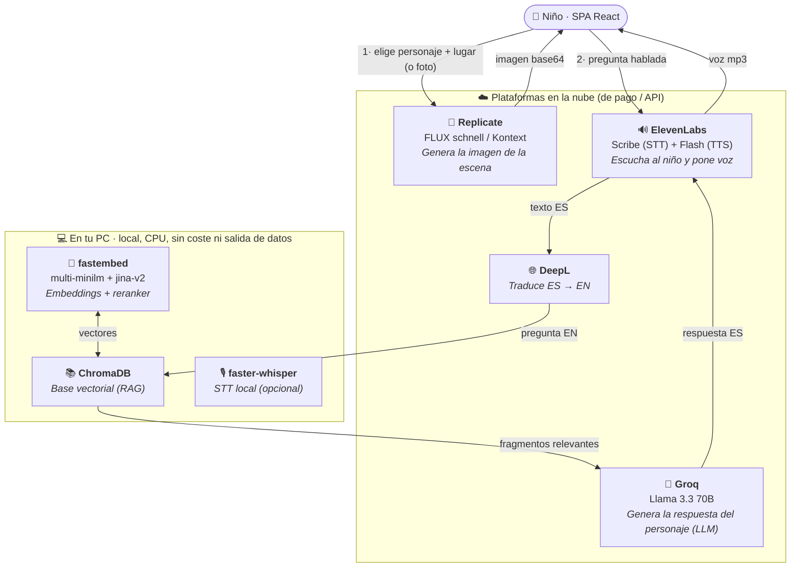

# Plataformas de IA del proyecto

Mapa de **qué inteligencia artificial usa la app y para qué**. Pensado como material para
la memoria del proyecto (Hito 10). La app combina **cuatro plataformas en la nube** (una de
ellas, Groq, con dos funciones: LLM y STT opcional → **5 claves API** en total) con un
**pipeline de RAG que corre entero en local** (CPU, sin coste ni envío de datos).

## Diagrama del flujo

## Para qué se usa cada una

### En la nube (4 plataformas)

La pantalla **Admin → APIs** gestiona **5 claves** (`secrets_service`): el LLM es un slot
**genérico "openai-compatible"** (no atado a un proveedor) y Groq aparece **dos veces** porque
la misma cuenta sirve el LLM y, opcionalmente, la transcripción — con **claves separadas**.

| Proveedor (pantalla APIs) | Función | Modelo / detalle | Secreto (`.env`) |
|---|---|---|---|
| **LLM openai-compatible** | **Chat / RAG** — genera la respuesta del personaje | Slot **configurable** (Groq / Mistral / Ollama…); hoy → **Groq · Llama 3.3 70B**, vía protocolo OpenAI | `LLM_API_KEY` |
| **Replicate** | **Generación de imagen** — la escena (personaje + lugar) | FLUX schnell; **FLUX Kontext** para "editar sobre tu foto" | `REPLICATE_API_TOKEN` |
| **DeepL** | **Traducción** ES→EN de la pregunta y de los documentos del RAG | Obligatoria: sin ella el RAG recupera mal | `DEEPL_API_KEY` |
| **ElevenLabs** | **Voz**: transcribe la pregunta hablada (STT, Scribe) y pone voz a la respuesta (TTS, Flash) | STT **por defecto** (una de tres opciones, ver abajo) | `ELEVENLABS_API_KEY` |
| **Groq transcription** | **STT alternativo** — transcribe la voz del niño | Whisper en Groq, si `STT_PROVIDER=groq` (opcional) | `GROQ_API_KEY` |

> **STT (voz→texto) seleccionable** (`STT_PROVIDER`, Hito 7): **ElevenLabs** (nube, por defecto)
> · **faster-whisper** (local, la voz no sale del PC) · **Groq** (Whisper en nube). El **LLM** es
> igual de configurable (`LLM_PROVIDER`/`LLM_BASE_URL`): hoy Groq, pero cambiar de proveedor es
> configuración, no código (ver la aclaración más abajo).

### En local (el RAG entero, sin coste ni envío de datos)

| Componente | Función | Modelo |
|---|---|---|
| **ChromaDB** | Base vectorial: guarda y recupera los fragmentos de conocimiento | local, en disco |
| **fastembed** (embeddings) | Convierte texto a vectores para buscar por significado | `multi-minilm` (ONNX/CPU, sin torch) |
| **fastembed** (reranker) | Reordena los fragmentos por relevancia real a la pregunta | `jina-v2` (ONNX/CPU) |
| **faster-whisper** | STT local **opcional** (la voz del niño no sale del PC) | `large-v3-turbo`; hoy inactivo (default = ElevenLabs) |

## Aclaración importante: `LLM_PROVIDER=openai` **no** es "OpenAI la empresa"

Es una fuente de confusión habitual. `openai` designa el **protocolo/SDK**, no el proveedor.
La API de OpenAI se volvió un *estándar de facto* que muchas plataformas implementan (Groq,
Mistral, Gemini-compat, OpenRouter, Ollama…). Las tres claves se leen **juntas**:

| Clave | Valor actual | Significado |
|---|---|---|
| `LLM_PROVIDER` | `openai` | El **protocolo** con el que se habla (el SDK de OpenAI) |
| `LLM_BASE_URL` | `https://api.groq.com/openai/v1` | **A quién** se le habla → **Groq** |
| `LLM_MODEL` | `llama-3.3-70b-versatile` | **Qué modelo** ejecuta Groq → **Llama 3.3 70B** |
| `LLM_API_KEY` | *(gsk_…)* | La clave **de Groq** |

**En claro:** el chat corre en **Llama 3.3 70B alojado en Groq**, accedido con el protocolo
OpenAI. **OpenAI (la empresa) no se usa.** El otro valor posible de `LLM_PROVIDER` es
`replicate` (la línea base histórica); Groq se eligió en el estudio comparativo del **Hito 6**
(ver [ADR-007](decisiones/ADR-007-eleccion-llm.md)). Cambiar de proveedor de LLM es **cambiar
configuración, no código** (capa `llm_service`, Hito 5).

## El flujo, plataforma a plataforma

1. **Crear la escena.** El niño elige personaje + lugar (o sube una foto) → **Replicate**
   (FLUX) dibuja la imagen y la devuelve en base64.
2. **El niño pregunta** (por texto o por voz):
   - Si es voz → **ElevenLabs** (Scribe) la transcribe a texto (o **faster-whisper** en local,
     o **Groq** (Whisper) en nube, según `STT_PROVIDER`).
   - El texto → **DeepL** lo traduce ES→EN (los embeddings y el conocimiento están en inglés).
   - **ChromaDB + fastembed** (embeddings + reranker `jina-v2`), en **local**, recuperan los
     fragmentos relevantes del personaje.
   - La pregunta + los fragmentos → **Groq** (Llama 3.3 70B) genera la respuesta en español.
   - La respuesta → **ElevenLabs** (TTS) le pone voz.

**Resumen:** 4 plataformas en la nube (Groq · Replicate · DeepL · ElevenLabs) + **todo el
RAG en local** (ChromaDB / fastembed). El único dato sensible que puede salir del dispositivo
es el *texto* de la pregunta (a DeepL y Groq); la foto no se persiste y la voz puede quedarse
en local. Detalle de privacidad en [PRIVACIDAD.md](PRIVACIDAD.md).
